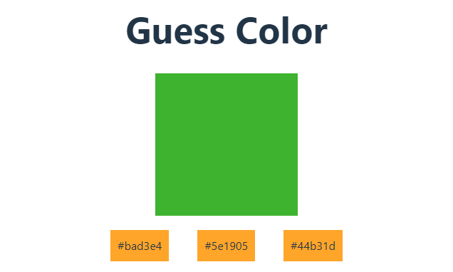

<!-- Guess Color -->

<h1>1. Guess Color</h1>

User have to click each hexadecimal color to guess exactly what color is in above box

<!-- API Calling -->

<h1>2. API Calling</h1>

User have to click each hexadecimal color to guess exactly what color is in above box

